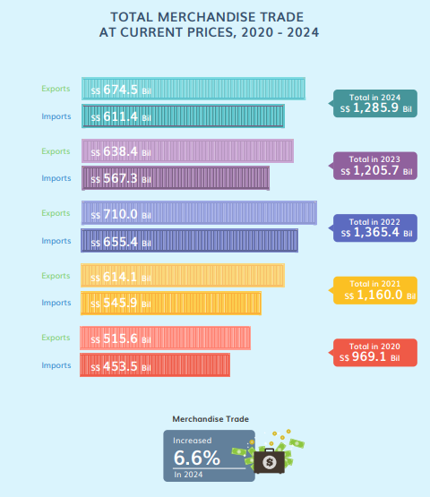
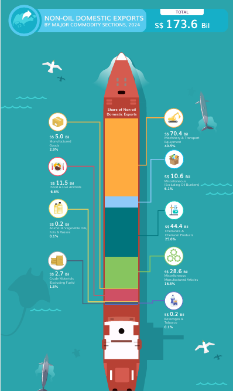
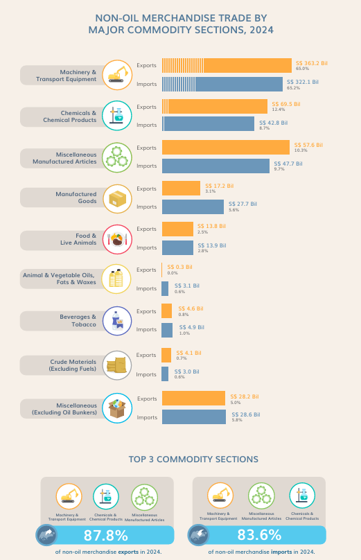

# Be Tradewise or Otherwise: Data Visualisation Makeover for Singapore International Trade 2024

## 1 Introduction

------------------------------------------------------------------------

### 1.1 Background

Since 2015, Singapore's international trade landscape has experienced significant shifts, influenced by global economic trends and geopolitical events. As a nation heavily reliant on trade, Singapore's economic health is closey tied to external markets.

The inauguration of President Donald Trump on January 20th, 2025 marked a new chapter in the U.S trade policy. His administration's decision to impose tariffs on imports from key trading partners, including China, and Mexico, signaled a shift towards protectionism. These measures aimed to address trade imbalances and protect domestic industries but also introduced uncertainties in global trade relations.

The escalating tensions between the U.S. and China have been a focal point for Singapore. Given its deep economic ties with both nations, Singapore has had to navigate a delicate balance. The potential for a global trade war poses risks to the region's economic stability, prompting Singaporean leaders to advocate for open and fair trade practices. ​

### 1.2 Objective and Tasks

The objective of this Take-home exercise is to improve on original visualization on [Singapore International Trade](https://www.singstat.gov.sg/modules/infographics/singapore-international-trade).

The specific tasks are :

-   Select three data visualization from [Singapore International Trade](https://www.singstat.gov.sg/modules/infographics/singapore-international-trade), comments on the pros and cons and provide sketches of the make-over

-   using appropriate ggplot2 and others packages create the make-over of the three data visualization critic above, and

-   analyse the data with either time-series analysis or time-series forecasting methods by compliment the analysis with appropriate data visualization methods and R packages.

## 2 Getting Started

------------------------------------------------------------------------

### 2.1 Setting the Analytic Tools

The following R package is used in this take-home exercise :

-   [**tidyverse**](https://www.tidyverse.org/) (i.e. readr, tidyr, dplyr, ggplot2) for performing data science tasks such as importing, tidying, and wrangling data, as well as creating graphics based on The Grammar of Graphics;

-   [**reshape2**](https://seananderson.ca/2013/10/19/reshape/) for transforming data between wide and long formats;

-   [**ggthemes**](https://ggplot2.tidyverse.org/reference/ggtheme.html) for extra themes, geoms, and scales for ggplot2;

-   [**ggridges**](https://cran.r-project.org/web/packages/ggridges/vignettes/introduction.html) for creating ridgeline plots;

-   [**ggdist**](https://mjskay.github.io/ggdist/) for visualising distributions and uncertainty; and

-   [**ggpubr**](https://rpkgs.datanovia.com/ggpubr/) for creating publication ready ggplot2 plots.

-   lubridate for converting category data into date format

The code chunk below using the p_load() function loads the specified packages, and if any package is missing, it automatically installs it before loading.

```{r}
pacman::p_load(tidyverse,
               ggthemes,scales,lubridate,treemap,SmartEDA,forecast)
```

### 2.2 The Data

The data set for this exercise is  [Merchandise Trade by Region/Market](https://www.singstat.gov.sg/find-data/search-by-theme/trade-and-investment/merchandise-trade/latest-data) from [Department of Statistics Singapore, DOS](https://www.singstat.gov.sg/) website.

The datasets includes the following key metrics :

-   Total Trade at Current Prices

-   Total Exports at Current Prices

-   Domestic Exports

-   Non-oil Domestic Exports

-   Re-exports

-   Total Imports at Current Prices

For the purpose of this take-home exercise, the 'Merchandise Trade by Commodity Selection' is used.

## 3 Data Processing

------------------------------------------------------------------------

### 3.1 Importing Data

The file was import into R environment using the read_csv() function from the readr package, which is part of the tidyverse.

```{r}
TradebyCommodity <- read_csv("data/InternationalMerchandiseTradebyCommoditySectionDivision.csv")
```

The dataset contains 105 rows and 734 columns.

### 3. 2 Glimpse of data

The below code chunk use the glimpse() function to provide a compact, transposed overview of the Tradebycommodity dataset.

```{r}
glimpse(TradebyCommodity)

```

The dataset consists of 68 rows and 734 columns, indicating that it is a wide-format time series dataset.

### 3. 3 Duplicates Check

The duplicated record is checked to prevent double counting of result by sum() duplicated_rows, to detect any if there is any duplicate.

```{r}
duplicated_rows <- duplicated(TradebyCommodity)
sum(duplicated_rows)  


TradebyCommodity[duplicated(TradebyCommodity),]


all_duplicates <- TradebyCommodity [duplicated(TradebyCommodity) | duplicated(TradebyCommodity, fromLast = TRUE),]

```

The results shows that there is 1 rows of duplicate record found.

The duplicate row was remove by the below code chunk.

```{r}
TradebyCommodity <- unique(TradebyCommodity)


if (require(dplyr)) {
  TradebyCommodity <- TradebyCommodity %>% distinct()
}
```

The below code check for duplicate again after removal.

```{r}
sum(duplicated(TradebyCommodity))
```

The returned value 0 indicate that there is no long any duplicated value in the dataset.

### 3.4 Check for missing value

The below code chunk is used for checking missing value (NA values) in each column of the dataset.

```{r}
colSums(is.na(TradebyCommodity))
```

The result shows there is no missing value in the dataset.

### 3.5 Transposing and Restructuring

For easier analysis and visualization, it was decided to convert the data from wide to long format. The below code chunk reshape the Tradebycommodity dataset by transposing it, converting dates from column name into a proper date column, and reorganizing the data structure.

```{r}
library(dplyr)
library(lubridate)  

date_col_names <- colnames(TradebyCommodity)[-1]  
TradebyCommodity1 <- as.data.frame(t(TradebyCommodity[-1]))  
colnames(TradebyCommodity1) <- make.names(TradebyCommodity[[1]], unique = TRUE)
TradebyCommodity1$Date <- rownames(TradebyCommodity1)
TradebyCommodity1 <- TradebyCommodity1 %>%
  mutate(Date = parse_date_time(Date, orders = "ymd", truncated = 2))
rownames(TradebyCommodity1) <- NULL  
TradebyCommodity1 <- relocate(TradebyCommodity1, Date, .before = everything())
str(TradebyCommodity1)
```

### 3.6 Data Exploration

The initial exploration using `ExpData(type=1)` reveals the following characteristics of the Tradebycommodity dataset. It is able to see that the data set consist of 68 variables and 733 sample.

```{r}
TradebyCommodity1%>%
  ExpData(type=1)
```

The are total 67 text variables and 1 date variable in the dataset.

The `ExpData(type=2)` describe the variables characteristics.

```{r}
TradebyCommodity1%>%
  ExpData(type=2)
```

### 3.7 Converting Datatype and Group the dataset by Year

The code chunk first converts factor variables(if there is any) into character format and then ensures all numeric columns are properly formatted by removing commas and spaces before converting them to numeric. It also extracts the year from the Date column and groups the data by year to compute total trade values for each commodity.

```{r}
TradebyCommodity1 <- TradebyCommodity1 %>%
  mutate(across(where(is.factor), as.character))
numeric_cols <- names(TradebyCommodity1)[-1]  
TradebyCommodity1[numeric_cols] <- lapply(TradebyCommodity1[numeric_cols], function(x) {
  x <- gsub(",", "", x)   
  x <- gsub("\\s+", "", x) 
  as.numeric(x)           
})

TradebyCommodity1 <- TradebyCommodity1 %>%
  mutate(Year = year(Date))
TradebyCommodity_Yearly <- TradebyCommodity1 %>%
  group_by(Year) %>%
  summarise(across(where(is.numeric), sum, na.rm = TRUE))

print(TradebyCommodity_Yearly)

```

## 4 Data Visualization Makeover

------------------------------------------------------------------------

### 4.1 Total Merchandise Trade At Current Prices, 2020 - 2024



The chart Total Merchandise Trade at Current Prices from 2020 to 2024 shows the exports and imports fro each year along with the total value.

😁Pros:

-   The colour-coding by year creates clear visual separation between time periods.

-   The horizontal bar format allow easy comparison of the exact values between exports and imports within each year, effectively show trends.

-   The inclusion of both exports, imports and yearly total provides complete information, highlights the latest trade growth percentage.

😖Cons:

-   The chart doesn't empathize year-over-year growth or decline in exports, imports or trade balance, not effectively showing the growth.

-   The vertical alignment makes it difficult to compare the same metric across different years.

-   The design with newest data at top might be misleading, and make it harder to see the progression over time.

**Makeover**

The sketch of the alternative design is as follows:

```{r}
df <- TradebyCommodity_Yearly

df <- df %>%
  filter(Year >= 2020 & Year <= 2024) %>%
  arrange(Year) %>%
  mutate(
    Total = Total.Merchandise.Imports...At.Current.Prices. + Total.Merchandise.Exports...At.Current.Prices.
  )


df_long <- df %>%
  select(Year, Total.Merchandise.Imports...At.Current.Prices., Total.Merchandise.Exports...At.Current.Prices.) %>%
  pivot_longer(cols = -Year, names_to = "Type", values_to = "Value")

df_long$Type_Clean <- ifelse(df_long$Type == "Total.Merchandise.Imports...At.Current.Prices.", 
                           "Import", "Export")

df_long$YearType <- paste(df_long$Year, df_long$Type_Clean)

legend_order <- c(
  "2020 Export", "2021 Export", "2022 Export", "2023 Export", "2024 Export",
  "2020 Import", "2021 Import", "2022 Import", "2023 Import", "2024 Import"
)
df_long$YearType <- factor(df_long$YearType, levels = legend_order)

max_value <- max(df_long$Value, na.rm = TRUE) / 1e9

max_per_year <- df_long %>%
  group_by(Year) %>%
  summarize(max_value = max(Value) / 1e9 + 0.05)

df_long <- df_long %>%
  left_join(max_per_year, by = "Year")

p <- ggplot() +  
  geom_col(data = df_long, 
           aes(x = as.factor(Year), y = Value / 1e9, fill = YearType), 
           position = position_dodge(width = 0.7), 
           width = 0.6) +
  
  geom_text(data = df_long, 
            aes(x = as.factor(Year), 
                y = max_value,
                label = round(Value / 1e9, 1),
                group = Type_Clean),
            position = position_dodge(width = 0.7),
            vjust = -0.5,
            size = 3.5) +
  
  geom_text(data = df, 
            aes(x = as.factor(Year), 
                y = max_value * 1.25, 
                label = paste("Total:", round((Total.Merchandise.Imports...At.Current.Prices. + 
                                             Total.Merchandise.Exports...At.Current.Prices.) / 1e9, 1), "B")),
            fontface = "bold",
            size = 3.5) +
  
  scale_y_continuous(
    name = "Value (Billions)",
    limits = c(0, max_value * 1.4) 
  ) +
  
  scale_fill_manual(
    values = c(
      "2020 Export" = "#aec7e8", "2020 Import" = "#1f77b4",
      "2021 Export" = "#ffbb78", "2021 Import" = "#ff7f0e",
      "2022 Export" = "#98df8a", "2022 Import" = "#2ca02c",
      "2023 Export" = "#ff9896", "2023 Import" = "#d62728",
      "2024 Export" = "#c5b0d5", "2024 Import" = "#9467bd"
    ),
    name = "Year and Trade Type",
    breaks = legend_order 
  ) +
  
  labs(
    title = "Merchandise Trade Performance (2020-2024)",
    subtitle = "Imports & Exports with Yearly Totals",
    x = NULL,
    caption = "Values shown in billions."
  ) +
  
  theme_minimal() +
  theme(
    plot.title = element_text(face = "bold", size = 14),
    plot.subtitle = element_text(size = 11, color = "gray30"),
    legend.position = "bottom",
    legend.title = element_text(face = "bold", size = 8),
    legend.text = element_text(size = 7),
    legend.key.size = unit(0.8, "lines"),
    legend.spacing.x = unit(0.2, "cm"),
    legend.margin = margin(t = 5, r = 0, b = 5, l = 0, unit = "pt"),
    panel.grid.minor = element_blank(),
    panel.grid.major.x = element_blank(),
    axis.title.y = element_text(margin = margin(r = 10), face = "bold")
  ) +
  guides(fill = guide_legend(nrow = 2, byrow = TRUE))

ggsave("trade_performance_reorganized_legend.png", plot = p, width = 10, height = 7, dpi = 300)

p
```

### 4. 2 Non-Oil Domestic Exports by Major Commodity Section 2024



The chart shows the Singapore's Non-Oil Domestic Export by Major Commodity Sections for 2024, using a cargo ship as a visual presentation of the share of export.

😁Pros:

-   The creative ship visualization catches attention

-   The graph has clear categorization of export components, the ship is dividing into different color-coded section, each representing a commodity category's proportion of the total exports

-   The graph shows both value and percentage for each category

-   The top three commodity section is highlighted

😖Cons:

-   The ship metaphor while being creative but make it harder to compare proportions

-   The small categories may reduce clarity of the presentation

-   The connection lines between different categories and visualization areas are confusing

-   Difficult to make precise comparisons between categories

**Makeover**

```{r}
df <- TradebyCommodity_Yearly
df <- df %>%
  rename_with(~ gsub("\\.+", " ", .), everything())

df_2024 <- df %>%
  filter(Year == 2024)

total_non_oil <- df_2024 %>% 
  pull(`Non Oil 3`)


df_2024_categories <- df_2024 %>%
  select(
    `Food Live Animals 3`,
    `Beverages Tobacco 3`,
    `Crude Materials Excl Fuels 3`,
    `Animal Vegetable Oils Fats Waxes 3`,
    `Chemicals Chemical Products 3`,
    `Manufactured Goods 3`,
    `Machinery Transport Equipment 3`,
    `Miscellaneous Manufactured Articles 3`,
    `Miscellaneous Excluding Oil Bunkers 3`
  ) %>%
  pivot_longer(cols = everything(), names_to = "Category", values_to = "Value")


df_2024_categories <- df_2024_categories %>%
  mutate(Category = gsub(" 3$", "", Category))  


df_2024_categories <- df_2024_categories %>%
  mutate(Category = ifelse(Value < quantile(Value, 0.2), "Other", Category)) %>%
  group_by(Category) %>%
  summarise(Value = sum(Value, na.rm = TRUE)) %>%
  ungroup()


sum_categories <- sum(df_2024_categories$Value)
cat("Total Non-Oil value:", total_non_oil, "\n")
cat("Sum of categories:", sum_categories, "\n")
cat("Difference:", total_non_oil - sum_categories, "\n")


treemap(
  df_2024_categories,
  index = "Category",
  vSize = "Value",
  title = paste0("2024 Non-Oil Trade Breakdown (Total: $", round(total_non_oil/1e9, 1), " Billion)"),
  palette = "Blues",
  border.col = "white"
)


ggplot(df_2024_categories, aes(x = reorder(Category, -Value), y = Value / 1e9, fill = Category)) +
  geom_col(show.legend = FALSE) +
  coord_flip() +
  labs(
    title = "Detailed Breakdown of Non-Oil Trade (2024)",
    subtitle = paste0("Total Non-Oil Trade: $", round(total_non_oil/1e9, 1), " Billion"),
    x = "Category",
    y = "Trade Value (in Billions)"
  ) +
  theme_minimal() +
  theme(
    plot.title = element_text(face = "bold"),
    plot.subtitle = element_text(face = "italic")
  )
```

### 4.3 Non-Oil Merchandise Trade by Major Commodity Section, 2024



The pie chart visualize Singapore's exports of services broken down by category for the year 2024, showing both the absolute value (in Billion SGD) and the percentage share of each service category.

😁Pros:

-   The chart has a clear comparative structure, the side by side display of exports and imports makes direct comparisons easy for each category

-   The categories are organized in a way that emphasizes the most significant trade categories

-   The ' Top 3 Commodity Sections' summary at the bottom effectively highlights the most important categories and their combined significance

-   Each category has a distinctive icon that aid in visual recognition

😖Cons:

-   There is no temporal comparison to show trends overtime

-   The bar lacks a consistent scale reference, making precise visual comparison difficult without reading the specific values.

-   Some categories like ' Miscellaneous (Excluding oil Bunkers)' might not be immediately clear to the viewers.

-   The categories aren't clearly sorted by value or alphabetically, making it harder to quickly identify patterns or relationships.

**Makeover**

```{r}
df <- TradebyCommodity_Yearly

df <- df %>%
  rename_with(~ gsub("\\.+", " ", .), everything()) %>%
  rename_with(~ trimws(.), everything())

df_2024 <- df %>%
  filter(Year == 2024) %>%
  select(
    `Non Oil 1`, `Food Live Animals 1`, `Beverages Tobacco 1`, `Crude Materials Excl Fuels 1`,
    `Animal Vegetable Oils Fats Waxes 1`, `Chemicals Chemical Products 1`, `Manufactured Goods 1`,
    `Machinery Transport Equipment 1`, `Miscellaneous Manufactured Articles 1`, `Miscellaneous Excluding Oil Bunkers 1`,
    `Non Oil 2`, `Food Live Animals 2`, `Beverages Tobacco 2`, `Crude Materials Excl Fuels 2`,
    `Animal Vegetable Oils Fats Waxes 2`, `Chemicals Chemical Products 2`, `Manufactured Goods 2`,
    `Machinery Transport Equipment 2`, `Miscellaneous Manufactured Articles 2`, `Miscellaneous Excluding Oil Bunkers 2`
  ) %>%
  pivot_longer(cols = everything(), names_to = "Category", values_to = "Value") %>%
  mutate(
    Type = ifelse(grepl(" 1$", Category), "Imports", "Exports"),
    Category = gsub(" 1$| 2$", "", Category)
  ) %>%
  group_by(Category, Type) %>%
  summarise(Value = sum(Value, na.rm = TRUE), .groups = "drop")

non_oil_imports <- df_2024 %>%
  filter(Category == "Non Oil" & Type == "Imports") %>%
  pull(Value)

non_oil_exports <- df_2024 %>%
  filter(Category == "Non Oil" & Type == "Exports") %>%
  pull(Value)

df_2024 <- df_2024 %>%
  filter(Category != "Non Oil")

df_2024 <- df_2024 %>%
  mutate(
    DisplayCategory = case_when(
      Category == "Food Live Animals" ~ "Food & Live Animals",
      Category == "Beverages Tobacco" ~ "Beverages & Tobacco",
      Category == "Crude Materials Excl Fuels" ~ "Crude Materials (excl. Fuels)",
      Category == "Animal Vegetable Oils Fats Waxes" ~ "Animal/Vegetable Oils & Fats",
      Category == "Chemicals Chemical Products" ~ "Chemical Products",
      Category == "Manufactured Goods" ~ "Manufactured Goods",
      Category == "Machinery Transport Equipment" ~ "Machinery & Transport Equipment",
      Category == "Miscellaneous Manufactured Articles" ~ "Misc. Manufactured Articles",
      Category == "Miscellaneous Excluding Oil Bunkers" ~ "Misc. (excl. Oil Bunkers)",
      TRUE ~ as.character(Category)
    )
  )

category_totals <- df_2024 %>%
  group_by(DisplayCategory) %>%
  summarize(TotalValue = sum(Value), .groups = "drop") %>%
  arrange(desc(TotalValue))

df_2024 <- df_2024 %>%
  mutate(DisplayCategory = factor(DisplayCategory, levels = category_totals$DisplayCategory))

import_color <- "#1D3557"  # Blue
export_color <- "#E63946"  # Red

max_value <- max(df_2024$Value) / 1e6
y_limit <- max_value * 1.35  

p <- ggplot(df_2024, aes(x = DisplayCategory, y = Value / 1e6, fill = Type)) +
  geom_col(position = position_dodge(width = 0.7), width = 0.6) +
  geom_text(
    aes(
      label = paste0("$", format(round(Value / 1e6, 1), big.mark = ","), "M"),
      hjust = -0.1  
    ),
    position = position_dodge(width = 0.7),
    vjust = 0.5,
    color = "black",  
    size = 2.8  
  ) +
  annotate(
    "text",
    x = 7,
    y = y_limit * 0.6,
    label = paste0("TOTAL\n",
                  "Imports: $", format(round(non_oil_imports / 1e6, 1), big.mark = ","), "M\n",
                  "Exports: $", format(round(non_oil_exports / 1e6, 1), big.mark = ","), "M"),
    size = 3.3,  
    hjust = 0,
    fontface = "bold",
    color = "black",
    lineheight = 1.2
  ) +
  coord_flip(ylim = c(0, y_limit)) +
  labs(
    title = "2024 Merchandise Trade Breakdown",
    subtitle = "By commodity category (values in millions)",
    x = NULL,
    y = "Trade Value ($ Millions)",
    fill = "Trade Type",
    caption = "Data source: TradebyCommodity_Yearly dataset"
  ) +
  scale_fill_manual(
    values = c("Imports" = import_color, "Exports" = export_color),
    labels = c("Imports", "Exports")
  ) +
  scale_y_continuous(
    labels = function(x) paste0("$", format(x, big.mark = ",", scientific = FALSE), "M"),
    expand = expansion(mult = c(0, 0.04))  
  ) +
  theme_minimal(base_size = 11) +
  theme(
    plot.title = element_text(size = 12, margin = margin(b = 2)),
    plot.subtitle = element_text(size = 9, color = "darkslategray", margin = margin(b = 5)),
    plot.caption = element_text(size = 7, color = "darkgray", hjust = 0),
    plot.margin = margin(t = 5, r = 90, b = 5, l = 5),
    legend.position = "top",
    legend.title = element_text(size = 9),
    legend.text = element_text(size = 8),
    legend.margin = margin(b = 3),
    legend.key.size = unit(0.8, "lines"),
    panel.grid.major.y = element_blank(),
    panel.grid.minor = element_blank(),
    panel.grid.major.x = element_line(color = "gray95"),
    axis.text.y = element_text(size = 9, margin = margin(r = 3)),
    axis.text.x = element_text(size = 8),
    axis.title.x = element_text(size = 9, margin = margin(t = 5))
  )

p
```

## 5 Time-series analysis - forecast for Singapore's Total Merchandise Trade

------------------------------------------------------------------------

### 5.1 Data Preparation 

The below code chunk assign the dataset TradebyCommodity1 to df, the Date column is converted to date format.

```{r}
df <- TradebyCommodity1

df <- df %>%
  mutate(Date = as.Date(Date)) %>%
  arrange(Date) 
df <- df %>% 
  mutate(across(where(is.character), ~ as.numeric(gsub(",", "", .))))
```

### 5.2 Creating a time series object 

The below code chunk create a new time frame df_ts, selecting only Date and Total Merchandise Trade At Current Price. The series starts from the earliest available year and month.

```{r}
df_ts <- df %>%
  select(Date, Total.Merchandise.Trade...At.Current.Prices.)


ts_data <- ts(df_ts$Total.Merchandise.Trade...At.Current.Prices., 
              start = c(year(min(df_ts$Date)), month(min(df_ts$Date))), 
              frequency = 12)

```

### 5.3 Data Visualization 

The below code chunk generated a line plot using ggplot 2. The Date is at X-axis, Total Merchandise Trade is at Y-axis, the blue line represents the historical trade value.

```{r}
ggplot(df_ts, aes(x = Date, y = Total.Merchandise.Trade...At.Current.Prices.)) +
  geom_line(color = "blue") +
  labs(title = "Singapore's Total Merchandise Trade (2020-2024)", 
       x = "Year", y = "Trade Value (Billions)") +
  theme_minimal()
```

### 5.4 Forecasting with ARIMA & Holt-Winters

The below code use auto.arima() to automatically find the best-fit ARIMA model for the next 36 months, 3years. The HoltWinters() is also used for exponential smoothing.

```{r}
arima_model <- auto.arima(ts_data)
forecast_arima <- forecast(arima_model, h = 36) 


hw_model <- HoltWinters(ts_data)
forecast_hw <- forecast(hw_model, h = 36)  


future_dates <- seq.Date(from = max(df_ts$Date) + months(1), 
                         by = "month", length.out = 36)

```

### 5.5 Creating Future Forecast Data 

The below code generate the future dates starting from the latest available date +1 month. A forecast dataframe (forecaste_df) is created, storing Date, forecasted Value from ARMA and Holt-Winters.

```{r}
forecast_df <- data.frame(Date = future_dates, 
                          ARIMA_Forecast = as.numeric(forecast_arima$mean), 
                          HoltWinters_Forecast = as.numeric(forecast_hw$mean))

```

### 5.6 Forecast Visualization 

The below code visualize the forecasted result, the blue line represent the historical trade value.

-    **Red dashline** : ARIMA forecast

-   **Green dotted line** :Holt-Winters forecast

-    **Black dotted vertical line** : the separation between historical and forecasted values.

-   **X-axis**: months with a 6-month interval

```{r}
ggplot(df_ts, aes(x = Date, y = Total.Merchandise.Trade...At.Current.Prices.)) +
  geom_line(color = "blue", size = 1, alpha = 0.8) +
  geom_line(data = forecast_df, aes(x = Date, y = ARIMA_Forecast), 
            color = "red", linetype = "dashed", size = 1) +
  geom_line(data = forecast_df, aes(x = Date, y = HoltWinters_Forecast), 
            color = "green", linetype = "dotted", size = 1) +
  labs(title = "Singapore's Total Merchandise Trade Forecast (2025)", 
       x = "Year", y = "Trade Value (Billions)") +
  theme_minimal() +
  scale_x_date(date_labels = "%Y-%m", date_breaks = "6 months") +
  theme(axis.text.x = element_text(angle = 45, hjust = 1)) +
  geom_vline(xintercept = max(df_ts$Date), linetype = "dotted", color = "black")
```

## Conclusion 

This take-home exercise explored the changing trends and patterns of Singapore's international trade since 2015. Three graphs were analyzed, highlighting their pros and cons, followed by sketches of their proposed remakes. Additionally, the forecast for Singapore's Oil Trade over the next 36 months (from 2025 onwards) was made using both ARIMA and Holt-Winters models. These forecasts provide valuable insights into the expected future trends in Singapore's commodity trade. To further refine these predictions, incorporating additional external variables, such as global oil price trends or geopolitical events, could enhance the accuracy of the forecasting models.

## Reference 

-   [R for Visual Analytics](https://r4va.netlify.app/)

-   [Merchandise Trade by Region/Market](https://www.singstat.gov.sg/find-data/search-by-theme/trade-and-investment/merchandise-trade/latest-data) 

-   [International Trade](https://www.singstat.gov.sg/modules/infographics/singapore-international-trade)
